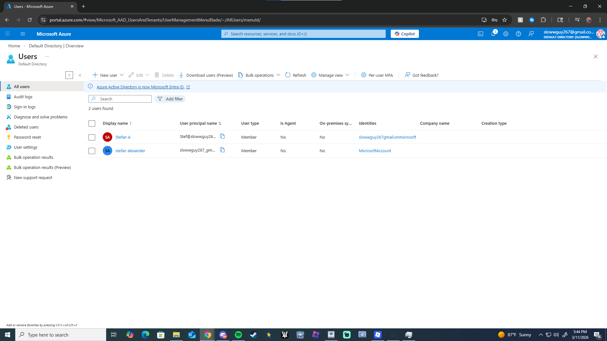
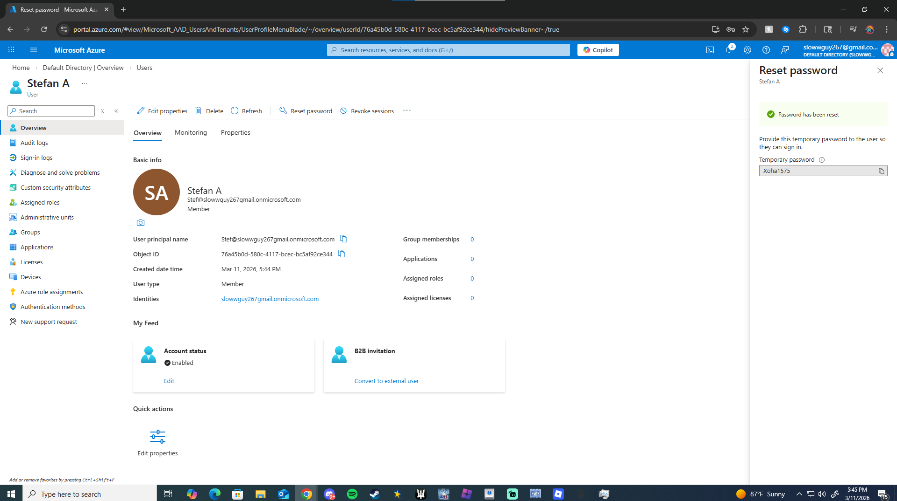
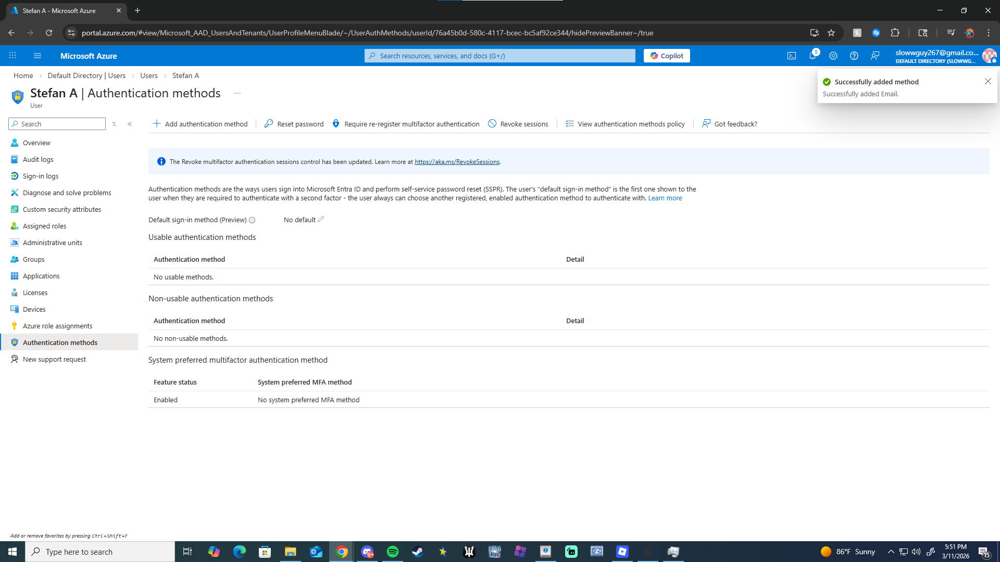

# Lab 1 — Entra ID (Azure AD) User Management

## Objective
Practice identity and user management tasks commonly performed by IT support administrators.

## Environment
- Microsoft Azure
- Microsoft Entra ID

## Tasks Completed

1. Created a new user account in Microsoft Entra ID
2. Configured display name and login credentials
3. Verified account creation in the directory
4. Reset the user password
5. Confirmed account was enabled

## Skills Practiced

- Identity and access management
- User provisioning
- Password reset procedures
- Azure portal navigation

## Example IT Support Scenario

User reports they cannot log in.

### Resolution Steps
1. Locate user in Entra ID
2. Reset password
3. Verify account is enabled
4. Confirm user can authenticate

## User Creation

## Password Reset

## Multi-Factor Authentication

## Outcome

Successfully created and managed users in Microsoft Entra ID and simulated common help desk account management tasks.
