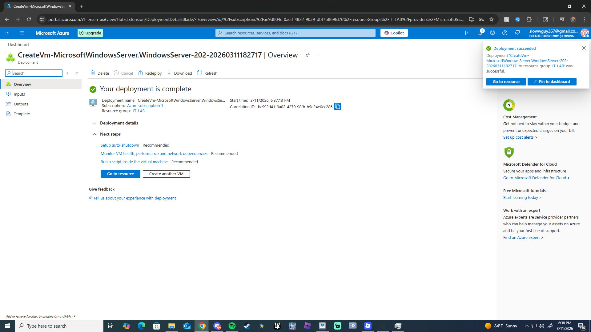
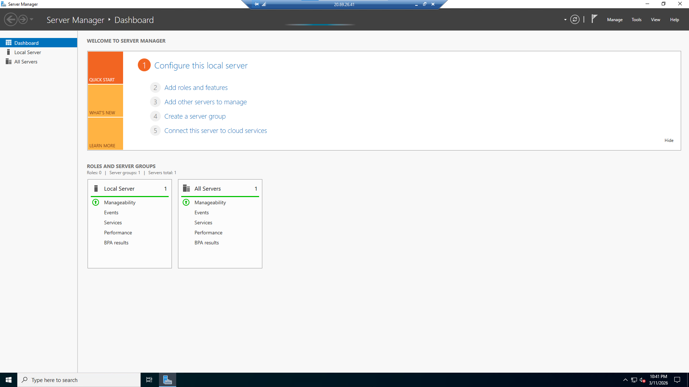
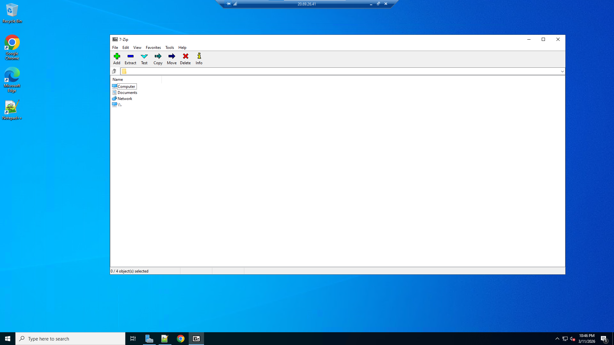

# Lab 2 — Azure Virtual Machine Administration

## Objective
Deploy and manage a Windows Server virtual machine in Microsoft Azure.

## Environment
- Microsoft Azure
- Windows Server 2022

## Tasks Completed

1. Created an Azure resource group
2. Deployed a Windows Server 2022 virtual machine
3. Selected VM size and region
4. Configured administrator credentials
5. Connected to the server using Remote Desktop (RDP)

## Skills Practiced

- Azure infrastructure deployment
- Virtual machine management
- Remote server administration

## Example IT Support Scenario

Administrator needs to access a server remotely.

### Resolution Steps

1. Connect to Azure VM
2. Download RDP file
3. Authenticate with admin credentials
4. Verify system functionality

## Azure VM Deployment

## Remote Desktop Connection

## Required Applications

## Outcome

Successfully deployed and accessed a Windows Server VM using Azure and Remote Desktop.
