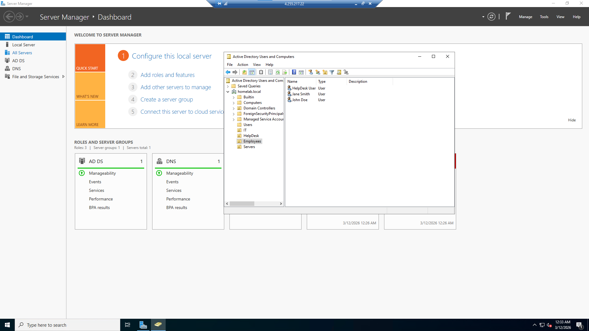
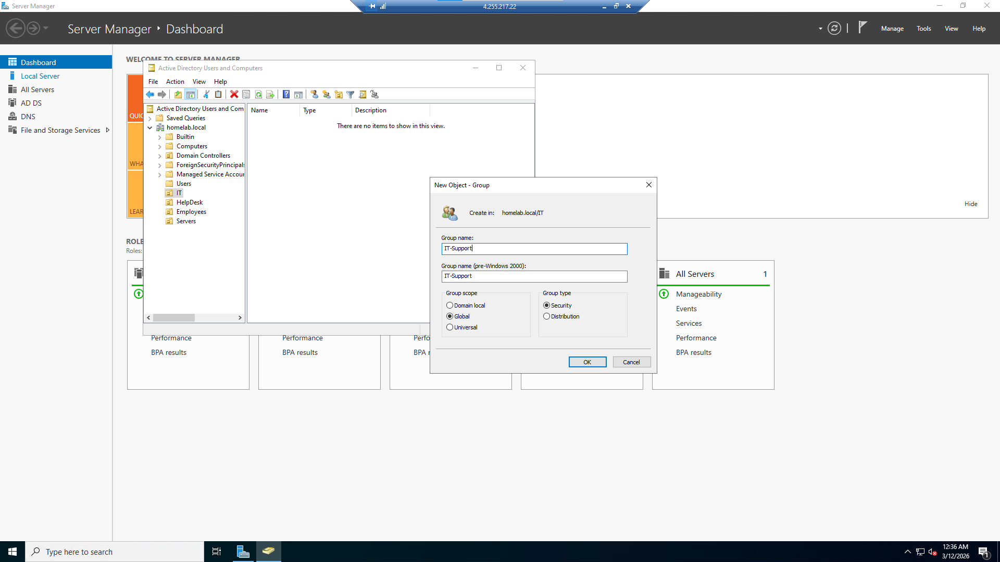
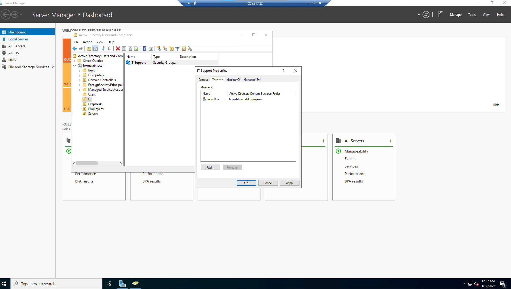
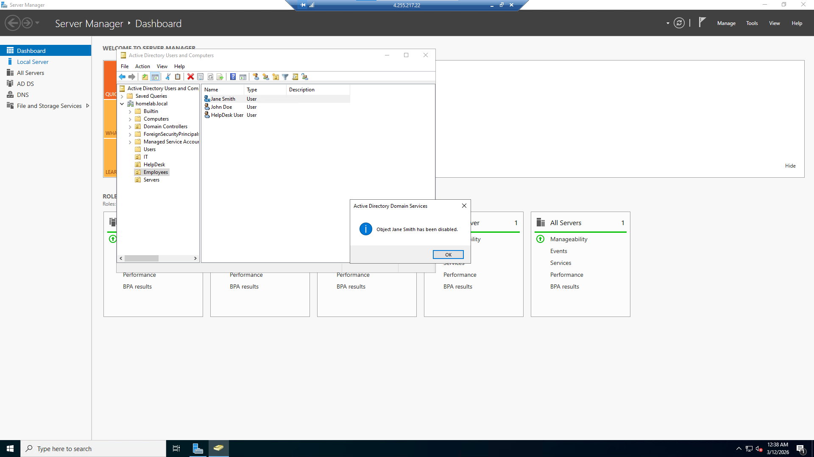

# Lab 5 — Active Directory User Management

## Objective
Deploy and manage Active Directory in a Windows Server environment and simulate common help desk account management tasks.

## Environment

- Microsoft Azure
- Windows Server 2022
- Active Directory Domain Services
- Remote Desktop

---

## Active Directory Setup

Active Directory Domain Services was installed on the server and promoted to a Domain Controller using the domain:
homelab.local

This allowed centralized management of users, groups, and computers.

---

## Organizational Units Created

The following Organizational Units (OUs) were created to organize users and resources.

- Employees
- IT
- HelpDesk
- Servers

---

## User Accounts Created

Test user accounts were created inside the Employees OU.

Example users:

- John Doe (jdoe)
- Jane Smith (jsmith)

---

## Password Reset Simulation

A password reset was performed to simulate a common help desk request where a user forgets their login credentials.

---

## Security Group Creation

A security group named **IT-Support** was created and users were added to the group to simulate permission assignment.

---

## Adding Users to Groups

Users were added to the IT-Support security group to simulate granting access to department resources.

---

## Disable User Account

A user account was disabled to simulate employee termination or account deactivation.

---

## Skills Demonstrated

- Active Directory administration
- Organizational Unit management
- User account creation
- Password reset troubleshooting
- Security group management
- Help desk account management workflows

---

## Outcome

This lab demonstrates foundational Active Directory administration tasks commonly performed by IT support technicians and system administrators.
